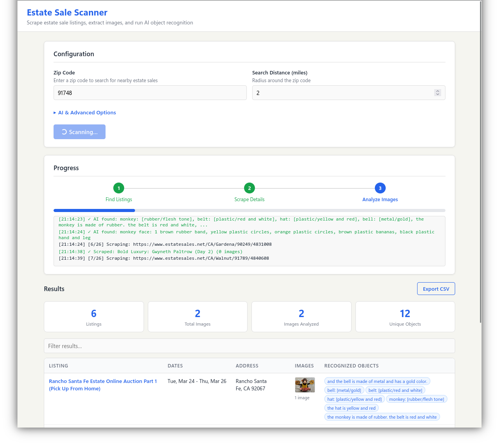

# Estate Sale Details Scanner

Scans [EstateSales.NET](https://www.estatesales.net/) by zip code, scrapes listing details (title, dates, address, photos), and sends images through an AI vision model (Ollama or OpenAI-compatible) to identify objects in each photo. Results stream in real-time via SSE to a browser UI with expandable rows, clickable image modals, and a text filter.

Built with Express, Playwright, and Sharp. The scraper navigates the search page, configures distance/sale-type filters, then scrapes each listing using multiple extraction strategies (Next.js data, JSON-LD, DOM selectors, network interception, gallery click-through). Images and page data are cached to disk with configurable TTLs to avoid redundant downloads.

Runs in Docker using the official Playwright base image. Configure the Ollama endpoint, model, concurrency, image scale, and cache durations via environment variables in `docker-compose.yml`.

Written with Claude, mostly.